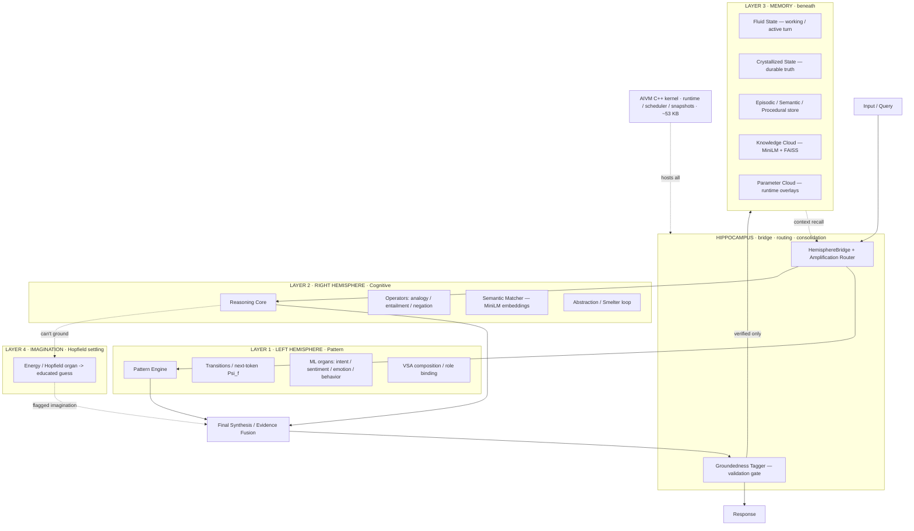

# Synthesus Brain — 4-Layer Wiring Diagram

Four functional layers on the AIVM C++ kernel: two large hemispheres bound by a
hippocampus, a memory layer beneath them, and an imagination layer. Every box
maps to a real, built component.



## Layers ↔ real components

| layer | role | built as |
|---|---|---|
| **Hippocampus** | bind L+R, route by learned trust, **validate before memory** | `HemisphereBridge` + amplification router (`vsa_amplify`); **groundedness tagger** (`synthesus_core`) is the consolidation gate |
| **L1 Left — Pattern** | fluency, what-follows, perception | transitions (`vsa_fusion_generator`), ML organs (`intent/sentiment/emotion`), VSA binding (`vsa_twolayer`) |
| **L2 Right — Cognitive** | meaning, structured reasoning | operators (`vsa_analogy/entail/negation`), Semantic Matcher (**MiniLM** via `embedding_backend`), abstraction (`vsa_abstract`) |
| **L3 Memory (beneath)** | working + durable + shared | Fluid/Crystallized (`conscious_state`), memory store, Knowledge Cloud (**MiniLM+FAISS**, `knowledge_cloud`), Parameter Cloud (`universal_substrate`) |
| **L4 Imagination** | associative completion / educated guess | Hopfield energy-settling (`vsa_hopfield`), tagged as imagination |
| **Runtime** | host / schedule / snapshot | AIVM C++ kernel (`packages/kernel`, ~53 KB) + AIVM Python kernel (`packages/aivm`) |

## The one rule that makes it a brain (not a mush)
**Nothing reaches Crystallized / durable memory unless the groundedness tagger
marks it `verified`.** Imagination (L4) and pattern guesses (L1) flow to the
response *flagged*, but only validated evidence consolidates into L3. That gate
is the hippocampus's job and it is already built.

## Footprint
- **Core kernel:** ~93 KB source → ~53 KB binary, ~0 baked weights, KB-scale RAM.
- **+ MiniLM organ:** ~80 MB (+ runtime). **+ hosted LLM (VSLLM slot):** GBs.
- The brain stays tiny; you pay only for the learned organs you mount.
```
LLM:            ████████████████  gigabytes
Synthesus core: ▏                 ~53 KB
```
