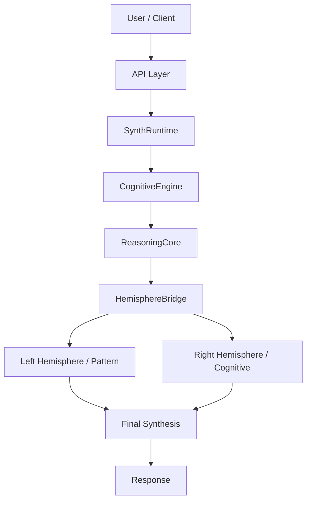
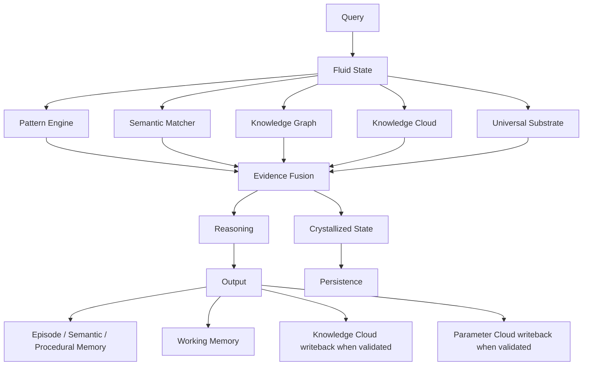

# Synthesus Complete Wiring Diagram

This document shows the intended end-to-end wiring of Synthesus: memory, retrieval, knowledge, parameters, reasoning, and API ingress.

## High-level architecture

## Memory and knowledge wiring

## Layer responsibilities

### Fluid state
The active turn brain.

Holds:
- current intent
- uncertainty
- hypotheses
- attention focus
- novelty signals
- short-lived context

Source: `file 'synthesus_framework/core/conscious_state.py'`

### Crystallized state
Stable truth and durable rule memory.

Holds:
- verified facts
- persistent traits
- stable rules
- known relationships
- long-lived world model updates

Source: `file 'synthesus_framework/core/conscious_state.py'`

### Memory store
Personal memory persistence.

Holds:
- episodic memories
- semantic memories
- procedural memories
- working memory

Source: `file 'synthesus_framework/core/memory_store.py'`

### Knowledge cloud
Shared world lore and semantic retrieval.

Holds:
- entities
- aliases
- facts
- relation graphs
- trust-gated lore

Source: `file 'synthesus_framework/core/knowledge_cloud.py'`

### Parameter cloud
Mutable runtime control plane.

Holds:
- traits
- runtime flags
- policy values
- shared parameter overlays

Source: `file 'synthesus_framework/core/universal_substrate.py'`

## Exact data flow

### Inbound read path

1. API receives query.
2. `SynthRuntime` assembles memory context.
3. `CognitiveEngine` loads local character state.
4. Pattern and semantic recall run first.
5. Knowledge graph and knowledge cloud provide evidence.
6. Parameter cloud supplies mutable overlays.
7. Fluid state is updated with current evidence.
8. Crystallized state is updated only if evidence is stable.
9. `ReasoningCore` and `HemisphereBridge` synthesize the answer.

### Outbound write path

1. Final response is produced.
2. Episodic memory stores the turn.
3. Semantic/procedural memory stores durable lessons.
4. Knowledge cloud stores validated shared lore.
5. Parameter cloud stores validated runtime traits / flags.
6. Persistence saves the long-term state.

## What should never happen

- Raw retrieval results being written directly into crystallized memory without validation.
- Parameter cloud becoming a second knowledge database.
- Knowledge cloud replacing the local memory store.
- Working memory being treated as durable truth.
- Pattern matches being promoted to facts without validation.

## Validation checklist

- [ ] Shared `KnowledgeCloud` instantiated once.
- [ ] Shared `UniversalSubstrate` instantiated once.
- [ ] `SynthRuntime` receives both.
- [ ] `CognitiveEngine` receives both.
- [ ] Query path can run with or without cloud availability.
- [ ] Crystallized state only receives validated updates.
- [ ] Memory round-trip works after restart.
- [ ] Conversation smoke test passes.

## Practical reading order for implementers

1. `file 'synthesus_framework/core/conscious_state.py'`
2. `file 'synthesus_framework/core/memory_store.py'`
3. `file 'synthesus_framework/core/knowledge_cloud.py'`
4. `file 'synthesus_framework/core/universal_substrate.py'`
5. `file 'synthesus_framework/core/synth_runtime.py'`
6. `file 'synthesus_framework/cognitive/cognitive_engine.py'`
7. `file 'synthesus_framework/core/reasoning_core.py'`
8. `file 'synthesus_framework/core/hemisphere_bridge.py'`
9. `file 'synthesus_framework/api/fastapi_server.py'`
10. `file 'synthesus_framework/api/production_server.py'`

## Final summary

The correct architecture is a staged pipeline:

- **Fluid** decides what is happening right now.
- **Retrieval** gathers evidence.
- **Crystallized** keeps only what is worth keeping.
- **Reasoning** turns evidence into a response.
- **Memory / cloud** persist the validated outcome.

That is the wiring contract.