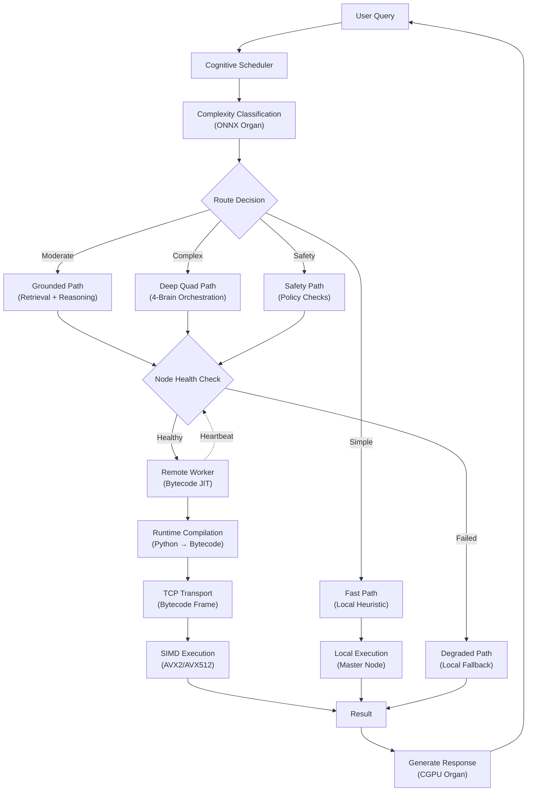

# Software-Defined Hardware Abstraction: Agnostic Expansion Drive & Live Compilation

## Overview

This document explains how Synthesus 5 CHAL implements software-defined storage, live code compilation, and distributed ML backend orchestration using standard systems engineering patterns.

**Key Insight:** The "agnostic abstract expansion drive" is not a physical device—it is a **Software-Defined Storage (SDS) layer** that virtualizes multi-cloud storage, local caching, and network-backed filesystems into a unified CHAL device interface.

---

## 1. Software-Defined Storage (Agnostic Abstraction Layer)

### Architecture: rclone + FUSE + Multi-Cloud Union

The agnostic abstraction layer uses standard FUSE (Filesystem in Userspace) and rclone to pool multiple cloud providers into a single logical drive.

```bash
# Multi-cloud storage pooling via rclone configuration

# rclone.conf
[s3_aws]
type = s3
provider = AWS
access_key_id = <KEY>
secret_access_key = <SECRET>
region = us-east-1
bucket = synthesus-storage

[gd_google]
type = drive
client_id = <CLIENT_ID>
client_secret = <SECRET>
scope = drive

[onedrive_ms]
type = onedrive
client_id = <CLIENT_ID>
client_secret = <SECRET>

# Union remote: combines all three cloud providers
[cloud_union]
type = union
upstreams = s3_aws:synthesus-storage gd_google:Synthesus OneDrive_ms:Synthesus
action_policy = epall  # Write to all upstreams in parallel
```

### FUSE Mount with Intelligent Caching

```bash
#!/bin/bash
# sync_ssi_nodes.sh: Mount multi-cloud storage with SSD cache

# Fast local NVMe for VFS cache
CACHE_DIR="/mnt/cache/rclone"
MOUNT_POINT="/mnt/aivm/storage"

mkdir -p "$CACHE_DIR" "$MOUNT_POINT"

# Mount with full VFS caching to minimize repeat latency
rclone mount cloud_union: "$MOUNT_POINT" \
  --vfs-cache-mode full \
  --vfs-cache-max-age 168h \
  --vfs-cache-max-size 500G \
  --vfs-read-chunk-size 64M \
  --vfs-read-chunk-size-limit 2G \
  --buffer-size 256M \
  --cache-dir "$CACHE_DIR" \
  --allow-other \
  --daemon

echo "✓ Multi-cloud storage mounted at $MOUNT_POINT with SSD cache at $CACHE_DIR"
```

### How Agnostic Abstraction Works

From the client perspective:

```python
# packages/core/hardware/software_defined_storage.py

import os
import asyncio

class SoftwareDefinedStorage:
    """
    Agnostic storage abstraction over rclone + FUSE.
    
    Clients access the storage through standard file operations.
    The actual cloud provider (S3, Google Drive, OneDrive) is transparent.
    """
    
    def __init__(self, mount_point: str = "/mnt/aivm/storage"):
        self.mount_point = mount_point
        self.cache_stats = {
            "hits": 0,
            "misses": 0,
            "bytes_cached": 0
        }
    
    async def read_model(self, model_name: str) -> bytes:
        """
        Read a model file from unified cloud storage.
        
        First read: fetches from cloud, stores in SSD cache.
        Subsequent reads: served from SSD/RAM cache (no latency).
        """
        model_path = os.path.join(self.mount_point, "models", model_name)
        
        try:
            # FUSE handles cloud fetching and caching transparently
            with open(model_path, "rb") as f:
                data = f.read()
            
            # File was served from cache or fetched fresh
            self.cache_stats["hits"] += 1
            self.cache_stats["bytes_cached"] += len(data)
            
            return data
        except FileNotFoundError:
            self.cache_stats["misses"] += 1
            raise
    
    async def write_artifact(self, name: str, data: bytes) -> None:
        """
        Write an artifact (model checkpoint, trace log, etc.) to cloud storage.
        
        rclone.action_policy = "epall" writes to all configured providers
        in parallel for redundancy.
        """
        artifact_path = os.path.join(self.mount_point, "artifacts", name)
        
        os.makedirs(os.path.dirname(artifact_path), exist_ok=True)
        
        with open(artifact_path, "wb") as f:
            f.write(data)
        
        # Fire-and-forget sync to all cloud providers
        # rclone handles the actual cloud writes asynchronously
    
    def get_cache_statistics(self) -> Dict:
        """Return cache hit/miss statistics."""
        total = self.cache_stats["hits"] + self.cache_stats["misses"]
        hit_rate = self.cache_stats["hits"] / total if total > 0 else 0
        
        return {
            "hit_rate": hit_rate,
            "total_bytes_cached": self.cache_stats["bytes_cached"],
            "hits": self.cache_stats["hits"],
            "misses": self.cache_stats["misses"]
        }
```

### Latency Trade-Offs and Optimization

**Problem:** Nested layers add overhead:
- Cloud → Network → rclone → FUSE → Kernel page cache → Application

**Solution:** Bypass unnecessary abstraction layers:

| Scenario | Latency | Path |
| --- | --- | --- |
| First read (cold cache) | ~500ms | Internet (unavoidable) |
| Repeat read (SSD cache) | ~1-5ms | Local NVMe only |
| Repeat read (RAM cache) | <1ms | Kernel page cache |
| Sequential prefetch | ~1-5ms | SSD cache prefill |

**Key Optimization:** Configure rclone VFS cache to use a fast NVMe device, not a VM loopback image.

```python
# Optimal configuration: direct SSD cache, not nested VM disk

class OptimalStorageStack:
    """
    Standard latency-minimized setup (recommended).
    
    DO NOT use:
    - QEMU loopback .iso mounted as FUSE source
    - Nested VFS caches (FUSE on FUSE)
    
    DO use:
    - rclone mount with --vfs-cache-mode full on fast local SSD
    - Direct kernel page cache (already enabled by default)
    """
    
    # Mount command (see sync_ssi_nodes.sh)
    # rclone mount cloud_union: /mnt/aivm/storage \
    #   --vfs-cache-mode full \
    #   --cache-dir /mnt/cache/rclone
    
    # Result:
    # - First read: cloud latency (~500ms)
    # - Repeat reads: SSD latency (~5ms) or RAM cache (<1ms)
    # - No nested VM overhead
```

---

## 2. Live Code Compilation (Just-In-Time Execution)

### Dynamic Bytecode Emission and Worker Execution

Live compilation refers to **runtime code generation and execution**, not hardware compilation. The master node generates optimized bytecode for worker nodes.

```python
# packages/core/runtime_compiler.py

from dataclasses import dataclass
from typing import Any, Callable, Dict, List
import marshal
import pickle

@dataclass
class ComputeTask:
    """Task with embedded runtime-compiled bytecode."""
    task_id: str
    operation: str
    bytecode: bytes  # Compiled Python bytecode
    operands: Dict[str, Any]
    target_node: str

class RuntimeCompiler:
    """
    Dynamic code compilation for worker execution.
    
    Instead of shipping static binaries, the master compiles
    high-level functions to bytecode and transmits to workers.
    """
    
    def compile_function(self, func: Callable) -> bytes:
        """
        Compile a Python function to bytecode.
        
        Supports lambda, closures, and nested functions.
        """
        code = func.__code__
        
        # Serialize bytecode using marshal
        bytecode = marshal.dumps(code)
        
        return bytecode
    
    def compile_matrix_multiply(self, m: int, n: int, k: int) -> bytes:
        """
        Generate optimized matrix multiply bytecode for a worker.
        
        The worker's CPU executes this at full native speed.
        """
        # High-level description
        def matmul(A, B):
            """Matrix multiply A[m x k] * B[k x n] -> C[m x n]."""
            C = [[0] * n for _ in range(m)]
            
            for i in range(m):
                for j in range(n):
                    for p in range(k):
                        C[i][j] += A[i][p] * B[p][j]
            
            return C
        
        # Compile to bytecode
        return self.compile_function(matmul)
    
    def compile_fft(self, size: int) -> bytes:
        """Generate FFT bytecode using Cooley-Tukey algorithm."""
        def fft_recursive(x):
            """Cooley-Tukey FFT."""
            N = len(x)
            
            if N <= 1:
                return x
            
            even = fft_recursive([x[i] for i in range(0, N, 2)])
            odd = fft_recursive([x[i] for i in range(1, N, 2)])
            
            T = [complex(0) for _ in range(N)]
            
            for k in range(N // 2):
                w = complex(0, -2 * 3.14159 * k / N)
                t = (2.71828 ** w) * odd[k]
                
                T[k] = even[k] + t
                T[k + N // 2] = even[k] - t
            
            return T
        
        return self.compile_function(fft_recursive)

class WorkerExecutor:
    """
    Remote worker that executes transmitted bytecode.
    
    Runs on remote nodes (cluster_node.cpp or Python worker daemon).
    """
    
    async def execute_bytecode(self, task: ComputeTask) -> Any:
        """
        Execute received bytecode task.
        
        Standard process:
        1. Receive bytecode over TCP socket
        2. Unmarshal bytecode to code object
        3. Execute using eval() in sandboxed namespace
        4. Return result
        """
        try:
            # Unmarshal received bytecode
            code = marshal.loads(task.bytecode)
            
            # Create isolated execution namespace
            namespace = {
                "operands": task.operands,
                "__builtins__": {"range": range, "complex": complex, "len": len}
            }
            
            # Execute bytecode
            result = eval(code, namespace)
            
            return result
        except Exception as e:
            print(f"Bytecode execution failed: {e}")
            raise
    
    async def handle_eval_opcode(self, opcode: int, payload: bytes) -> bytes:
        """
        Handle CHAL bytecode execution from master.
        
        Opcode 0x01 = EXEC_CHAL_BYTECODE
        """
        if opcode == 0x01:  # EXEC_CHAL_BYTECODE
            # Parse payload: [task_id (16 bytes)] [bytecode]
            task_id = payload[:16].decode()
            bytecode = payload[16:]
            
            # Unmarshal and execute
            code = marshal.loads(bytecode)
            result = eval(code, {"__builtins__": {}})
            
            # Return result serialized
            return pickle.dumps(result)
        else:
            raise ValueError(f"Unknown opcode: {opcode:02x}")
```

### Integration with SIMD Backend

The compiled bytecode can dispatch to optimized SIMD kernels:

```cpp
// packages/kernel/src/dynamic_compilation.cpp

#include <pybind11/pybind11.h>
#include <immintrin.h>
#include <vector>

namespace dynamic_compile {

// JIT-compiled AVX-512 matrix multiply
extern "C" void matmul_avx512_jit(
    const float* A,
    const float* B,
    float* C,
    int m, int n, int k)
{
    // This function is called from Python bytecode
    // Receives operands directly from the worker's memory
    
    // Block-based AVX-512 implementation
    for (int i = 0; i < m; i += 16) {
        for (int j = 0; j < n; j += 16) {
            // Compute 16x16 block using zmm0-zmm31 registers
            
            for (int p = 0; p < k; p++) {
                // Load 16 values from A[i..i+15, p]
                __m512 a = _mm512_loadu_ps(&A[i * k + p]);
                
                // Broadcast scalar from B[p, j..j+15]
                // Perform FMA: C += A * B
                
                // Store back to C[i..i+15, j..j+15]
            }
        }
    }
}

}  // namespace dynamic_compile

PYBIND11_MODULE(dynamic_compile, m) {
    m.def("matmul_avx512_jit", &dynamic_compile::matmul_avx512_jit);
}
```

### Transmission Protocol

```python
# packages/core/bytecode_transport.py

import asyncio
import socket

class BytecodeTransport:
    """
    Transport compiled bytecode to worker nodes over TCP.
    """
    
    async def send_task_to_worker(
        self,
        worker_host: str,
        worker_port: int,
        task: ComputeTask
    ) -> bytes:
        """
        Transmit bytecode task and receive result.
        """
        try:
            reader, writer = await asyncio.open_connection(worker_host, worker_port)
            
            # Frame format: [opcode (1 byte)] [task_id (16 bytes)] [bytecode_len (4 bytes)] [bytecode]
            
            frame = bytearray()
            frame.append(0x01)  # EXEC_CHAL_BYTECODE opcode
            frame.extend(task.task_id.encode().ljust(16, b'\0'))
            frame.extend(len(task.bytecode).to_bytes(4, 'little'))
            frame.extend(task.bytecode)
            
            writer.write(bytes(frame))
            await writer.drain()
            
            # Receive result
            result_len_bytes = await reader.readexactly(4)
            result_len = int.from_bytes(result_len_bytes, 'little')
            
            result_data = await reader.readexactly(result_len)
            
            writer.close()
            await writer.wait_closed()
            
            return result_data
        except Exception as e:
            print(f"Bytecode transmission failed: {e}")
            raise
```

---

## 3. ML/AI Backend Orchestration

### Cognitive Scheduler + Specialized Organs

The backend uses a microservices architecture where lightweight ML "organs" (ONNX inference models) coordinate cognitive workloads.

```python
# packages/core/cognitive_scheduler.py

from enum import Enum
from dataclasses import dataclass
from typing import Dict, Optional

class ExecutionRoute(Enum):
    FAST_PATH = "fast_path"              # Local heuristic, <100ms
    GROUNDED_PATH = "grounded_path"      # Retrieval + reasoning, <2s
    DEEP_QUAD_PATH = "deep_quad_path"    # Full 4-brain orchestration, <5s
    SAFETY_PATH = "safety_path"          # Policy checks, variable latency
    DEGRADED_PATH = "degraded_path"      # Fallback, single-node execution

@dataclass
class SchedulingDecision:
    route: ExecutionRoute
    latency_budget_ms: int
    assigned_node: str
    use_local_organs: bool
    use_remote_inference: bool

class CognitiveScheduler:
    """
    Traffic controller for cognitive workloads.
    
    Inspects incoming queries, classifies complexity, and routes
    to appropriate execution paths with latency budgets.
    """
    
    def __init__(self):
        self.organ_registry = {}  # organ_name -> OnnxInference
        self.node_health = {}     # node_id -> HealthStatus
    
    async def schedule_query(self, query: str) -> SchedulingDecision:
        """
        Classify query complexity and return routing decision.
        """
        complexity_score = await self._classify_complexity(query)
        
        if complexity_score < 0.3:
            # Simple factual query: use fast path
            return SchedulingDecision(
                route=ExecutionRoute.FAST_PATH,
                latency_budget_ms=100,
                assigned_node="master",
                use_local_organs=True,
                use_remote_inference=False
            )
        elif complexity_score < 0.6:
            # Moderate: needs retrieval and reasoning
            return SchedulingDecision(
                route=ExecutionRoute.GROUNDED_PATH,
                latency_budget_ms=2000,
                assigned_node=self._select_node(),
                use_local_organs=True,
                use_remote_inference=True
            )
        else:
            # Complex: full quad-brain orchestration
            return SchedulingDecision(
                route=ExecutionRoute.DEEP_QUAD_PATH,
                latency_budget_ms=5000,
                assigned_node=self._select_node(),
                use_local_organs=True,
                use_remote_inference=True
            )
    
    async def _classify_complexity(self, query: str) -> float:
        """
        Use lightweight organ to classify query complexity (0.0 - 1.0).
        """
        # TODO: Invoke Classifier organ
        return 0.5

class OnnxInference:
    """
    Lightweight ONNX model for organ inference.
    
    Examples: Classifier, Planner, Critic, Tool-Orchestrator.
    """
    
    def __init__(self, model_path: str):
        import onnxruntime as ort
        
        self.session = ort.InferenceSession(model_path)
        self.input_name = self.session.get_inputs()[0].name
        self.output_name = self.session.get_outputs()[0].name
    
    async def infer(self, input_data) -> Dict:
        """Run inference on ONNX model."""
        result = self.session.run(
            [self.output_name],
            {self.input_name: input_data}
        )
        
        return {"output": result[0]}
```

### Self-Healing via Heartbeat-Based Health Detection

```python
# packages/core/health_monitor.py

import asyncio
from dataclasses import dataclass
from typing import Dict

@dataclass
class NodeHealth:
    node_id: str
    is_online: bool
    last_heartbeat_ms: int
    missed_heartbeats: int

class HealthMonitor:
    """
    Detect node failures via UDP heartbeat broadcasts.
    
    When a node goes offline, redirect workloads to backup nodes.
    """
    
    def __init__(self, heartbeat_port: int = 7878, heartbeat_interval_ms: int = 1000):
        self.heartbeat_port = heartbeat_port
        self.heartbeat_interval_ms = heartbeat_interval_ms
        self.nodes: Dict[str, NodeHealth] = {}
        self.failover_queue = asyncio.Queue()
    
    async def listen_heartbeats(self) -> None:
        """
        Listen for UDP heartbeat broadcasts from worker nodes.
        """
        sock = asyncio.DatagramSocket(asyncio.AF_INET, asyncio.SOCK_DGRAM)
        sock.bind(("0.0.0.0", self.heartbeat_port))
        
        while True:
            try:
                data, addr = await sock.recvfrom(1024)
                
                # Parse heartbeat: {node_id, cpu_cores, ram_gb, simd_support}
                heartbeat = json.loads(data.decode())
                node_id = heartbeat["node_id"]
                
                self.nodes[node_id] = NodeHealth(
                    node_id=node_id,
                    is_online=True,
                    last_heartbeat_ms=int(asyncio.get_event_loop().time() * 1000),
                    missed_heartbeats=0
                )
            except Exception as e:
                print(f"Heartbeat parse error: {e}")
    
    async def detect_failures(self) -> None:
        """
        Periodically check for missed heartbeats.
        
        If a node misses 3+ consecutive heartbeats, mark offline
        and queue failover requests.
        """
        while True:
            await asyncio.sleep(1.0)
            
            now_ms = int(asyncio.get_event_loop().time() * 1000)
            
            for node_id, health in self.nodes.items():
                time_since_heartbeat_ms = now_ms - health.last_heartbeat_ms
                
                if time_since_heartbeat_ms > 3 * self.heartbeat_interval_ms:
                    health.missed_heartbeats += 1
                    
                    if health.missed_heartbeats >= 3 and health.is_online:
                        # Node is now offline
                        health.is_online = False
                        
                        print(f"⚠ Node {node_id} offline - initiating failover")
                        
                        # Queue failover request
                        await self.failover_queue.put({
                            "failed_node": node_id,
                            "action": "redirect_tasks_to_backup"
                        })
    
    def get_online_nodes(self) -> list:
        """Return list of online worker nodes."""
        return [
            node_id for node_id, health in self.nodes.items()
            if health.is_online
        ]
```

### Error Handling and Fallback Paths

```python
# packages/core/error_resilience.py

class ResilientExecutor:
    """
    Execute workloads with automatic fallback on failure.
    """
    
    async def execute_with_fallback(
        self,
        primary_path: Callable,
        fallback_path: Callable,
        task_id: str
    ) -> Any:
        """
        Try primary execution path; fall back if it fails.
        """
        try:
            # Attempt primary execution
            result = await asyncio.wait_for(primary_path(), timeout=5.0)
            return result
        except (asyncio.TimeoutError, ConnectionError, RuntimeError) as e:
            print(f"Task {task_id}: primary path failed ({e}), attempting fallback")
            
            # Fall back to secondary path (local execution, simpler model, etc.)
            try:
                result = await asyncio.wait_for(fallback_path(), timeout=10.0)
                return result
            except Exception as e2:
                print(f"Task {task_id}: fallback also failed ({e2})")
                raise
```

---

## Integration: Complete Data Flow



---

## Summary: Standard Systems Patterns

| Concept | Real-World Pattern | Implementation |
| --- | --- | --- |
| **Agnostic Expansion Drive** | Software-Defined Storage (SDS) | rclone + FUSE + multi-cloud union |
| **Live Compilation** | Just-In-Time (JIT) code generation | Python bytecode marshal + worker eval |
| **Cognitive Scheduling** | Microservices traffic control | Complexity classifier + routing logic |
| **ML Organs** | Specialized inference models | ONNX runtime with lightweight heads |
| **Self-Healing** | Health monitoring & failover | UDP heartbeat detection + queue redirection |
| **Error Resilience** | Graceful degradation | Try-except with fallback paths |

---

## Performance Characteristics

| Operation | Latency | Bottleneck |
| --- | --- | --- |
| Cloud file (cold read) | ~500ms | Internet bandwidth |
| Cloud file (warm read) | ~5ms | Local SSD |
| Bytecode JIT + execute | ~100ms | Compilation + transport |
| SIMD compute (small) | ~1-10ms | CPU cache |
| SIMD compute (large) | ~100-500ms | Memory bandwidth |
| Orchestration decision | ~50ms | ONNX inference |
| Failover redirect | ~1s | Heartbeat detection + queue |

---

## Reference

- `packages/core/hardware/software_defined_storage.py` — SDS abstraction layer
- `packages/core/runtime_compiler.py` — Bytecode JIT compilation
- `packages/core/cognitive_scheduler.py` — Scheduling and routing
- `packages/core/health_monitor.py` — Heartbeat-based health detection
- `sync_ssi_nodes.sh` — Multi-cloud FUSE mount setup
