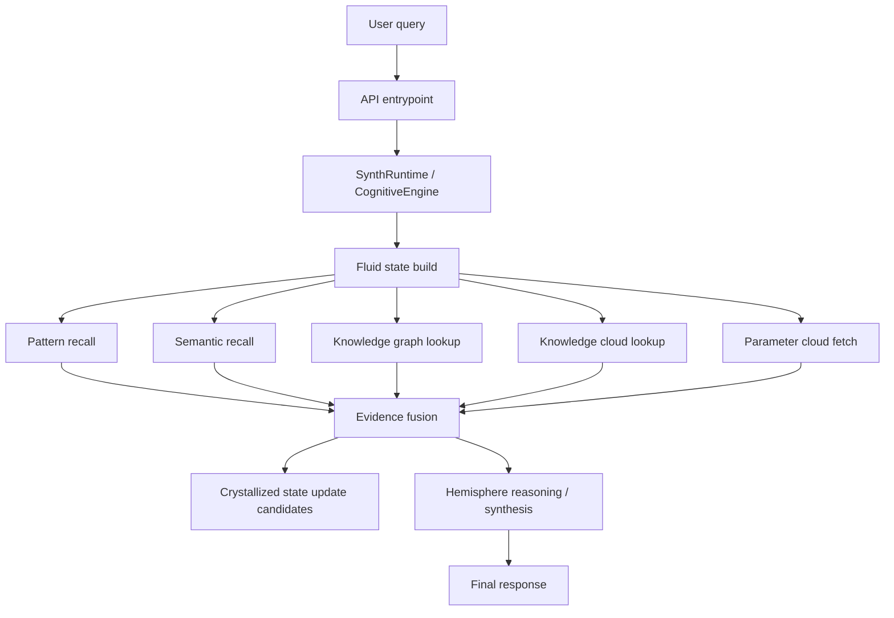
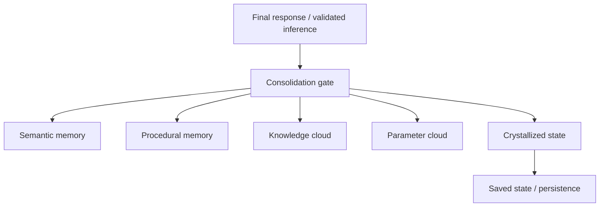

# Memory + Knowledge Wiring Plan

This document is the implementation map for connecting **fluid memory**, **crystallized memory**, **vector retrieval**, **pattern retrieval**, **knowledge cloud**, and **parameter cloud** in Synthesus.

## Core rule

- **Fluid memory** holds live turn-state: attention, hypotheses, uncertainty, current goals, recent context.
- **Crystallized memory** holds durable truth: stable facts, verified lore, persistent traits, and validated rules.
- **Vector / pattern databases** are retrieval layers, not memory layers.
- **Knowledge cloud** is the shared semantic world store.
- **Parameter cloud** is for mutable runtime parameters and traits, not raw knowledge facts.

If retrieval and memory are mixed together, the architecture becomes ambiguous and hard to debug.

---

## Module map

| Layer | Primary file(s) | Job |
|---|---|---|
| Fluid state | `core/conscious_state.py` | Live hypotheses, uncertainty, attention, current goals |
| Crystallized state | `core/conscious_state.py` | Stable facts, traits, rules, verified knowledge |
| Memory store | `core/memory_store.py` | Episodic, semantic, procedural, working memory |
| Pattern engine | `core/pattern_engine.py` | Trigger recall, chain generation, local pattern synthesis |
| Semantic matcher | `cognitive/semantic_matcher.py` | Local semantic similarity for character genome content |
| Knowledge graph | `cognitive/knowledge_graph.py` | Per-character structured knowledge |
| Knowledge cloud | `core/knowledge_cloud.py` | Shared world lore + FAISS search + alias matching |
| Parameter cloud | `core/universal_substrate.py`, `api/parameter_cloud.py` | Shared mutable parameters and trait routing |
| Runtime wiring | `core/synth_runtime.py` | Top-level memory/context assembly |
| Per-character reasoning | `cognitive/cognitive_engine.py` | Turn handling and evidence fusion |
| Hemisphere arbitration | `core/reasoning_core.py`, `core/hemisphere_bridge.py` | Left/right pass, merge, and synthesis |
| API orchestration | `api/fastapi_server.py`, `api/production_server.py` | Request ingress, shared-layer initialization |

---

## Required wiring behavior

### 1. Query enters fluid first

Every request should begin by building a **fluid context**:

- query text
- intent / sentiment / urgency
- recent memory recall
- pattern hits
- knowledge hits
- uncertainty / novelty / conflict signals

This means the retrieval layers feed **into** fluid state, not around it.

### 2. Retrieval layers provide evidence

Use all of these as evidence sources:

- local pattern match results
- local semantic matcher output
- per-character knowledge graph hits
- shared knowledge cloud hits
- parameter cloud values for current traits / runtime settings

These are ranked and fused into a single turn context.

### 3. Crystallized memory receives only validated material

Do **not** write every retrieved result into long-term memory.

Only consolidate to crystallized memory when the result is:

- stable across multiple turns
- externally verified
- explicitly user-confirmed
- or structurally important to the character/world model

Good write targets:

- `MemoryStore.store_semantic()`
- `MemoryStore.store_procedural()`
- `KnowledgeCloud.upsert_entry()`
- persistent trait / parameter updates through `UniversalSubstrate.set_parameter()`

Bad write targets:

- raw speculation
- transient hallucination-like outputs
- one-off turn noise
- unverified pattern matches

---

## Read path

### What each layer contributes

- **Pattern recall**: fast trigger matching and response templates.
- **Semantic recall**: local similarity over stored memories or character content.
- **Knowledge graph**: typed per-character world knowledge.
- **Knowledge cloud**: shared world lore, aliases, entities, and facts.
- **Parameter cloud**: mutable traits, policy flags, runtime knobs, and shared configuration.

---

## Write path

### Consolidation gate

Before writing anything long-lived, check:

1. Was it repeated or reinforced?
2. Was it validated by a trusted source?
3. Does it belong to stable world knowledge or just a single turn?
4. Is it a fact, a rule, a trait, or a temporary observation?

If the answer is unclear, keep it in fluid memory only.

---

## Exact connection points

### `core/synth_runtime.py`

This is the runtime spine.

It should:

- assemble recall from episodic / semantic / procedural / working memory
- add knowledge-cloud context when available
- pass the combined context into `ReasoningCore`
- write back validated semantic/procedural memories after response generation

### `cognitive/cognitive_engine.py`

This is the per-character reasoning boundary.

It should:

- fetch local character knowledge first
- query `KnowledgeCloud.lookup_multi()` for shared lore when needed
- query `UniversalSubstrate` for parameter / trait overlays
- keep retrieved evidence in the active turn context
- record witnessed facts back into the cloud only when they are worth retaining

### `core/knowledge_cloud.py`

This is the shared world memory and semantic retrieval layer.

It should:

- serve FAISS-backed vector retrieval
- resolve aliases
- return ranked multi-entity results for synthesis
- accept validated writeback via `upsert_entry()`

### `core/universal_substrate.py`

This is the parameter router.

It should:

- fetch mutable parameters and trait overlays
- persist runtime settings
- avoid acting like a fact store

### `core/conscious_state.py`

This is the live state model.

It should keep:

- `FluidState` for active hypotheses and uncertainty
- `CrystallizedState` for stable facts and rules
- `NarrativeState` for identity continuity and timeline

### `core/memory_store.py`

This is the durable personal memory backend.

It should keep:

- episodic memory for interaction history
- semantic memory for facts
- procedural memory for learned behaviors
- working memory for volatile scratch state

### `core/reasoning_core.py` and `core/hemisphere_bridge.py`

These are the synthesis layers.

They should:

- consume the fused context
- run left/right passes
- arbitrate the result
- return a response plus confidence / agreement metadata

### `api/fastapi_server.py` and `api/production_server.py`

These are the API edges.

They should:

- initialize shared layers once
- inject them into runtime and cognitive engine construction
- expose health / stats so you can confirm the wiring is alive

---

## Implementation phases

### Phase 1 — Make shared layers explicit

- Create shared `KnowledgeCloud` and `UniversalSubstrate` singletons at startup.
- Pass them into runtime and cognitive engine constructors.
- Confirm health endpoints can see them.

### Phase 2 — Build a unified evidence context

- Add a compact context object that carries:
  - fluid signals
  - memory recall
  - pattern hits
  - knowledge-cloud hits
  - parameter overlays
- Feed that object into the reasoning core.

### Phase 3 — Add validated writeback

- Add consolidation hooks that write only validated material into:
  - semantic memory
  - procedural memory
  - knowledge cloud
  - parameter cloud
  - crystallized state

### Phase 4 — Verify with smoke tests

- Memory round-trip test
- Knowledge cloud lookup test
- Parameter cloud fetch test
- End-to-end conversation test
- Restart/persistence test

---

## What “correct” looks like

A clean turn should behave like this:

1. The user asks a question.
2. Fluid state is assembled.
3. Pattern / semantic / knowledge retrieval runs.
4. Shared knowledge and parameter overlays are injected.
5. Crystallized memory is updated only if the result is stable.
6. Left/right hemisphere synthesis produces the answer.
7. The result is logged into episodic memory and reasoning traces.

That is the intended contract.

---

## What to avoid

- Writing raw search results directly into crystallized memory.
- Treating parameter cloud as a fact database.
- Using knowledge cloud as a replacement for per-character memory.
- Letting one-off pattern hits become durable truth.
- Mixing runtime state, persistence state, and retrieval state into one blob.

---

## Short wiring checklist

- [ ] Shared `KnowledgeCloud` exists once per runtime.
- [ ] Shared `UniversalSubstrate` exists once per runtime.
- [ ] `SynthRuntime` sees both.
- [ ] `CognitiveEngine` sees both.
- [ ] `ReasoningCore` receives fused context.
- [ ] `FluidState` is the active turn-state.
- [ ] `CrystallizedState` only stores validated information.
- [ ] Memory store handles durable personal memory.
- [ ] Knowledge cloud handles shared world lore.
- [ ] Parameter cloud handles mutable runtime traits.
- [ ] Conversation smoke test passes after restart.

---

## Handoff summary

The architecture is not “memory versus retrieval.”

It is:

- **Fluid state** for live reasoning
- **Crystallized state** for durable truth
- **Memory store** for personal persistence
- **Knowledge cloud** for shared world knowledge
- **Parameter cloud** for mutable control data
- **Pattern/vector retrieval** for evidence
- **Hemisphere reasoning** for synthesis

That separation is the system.
