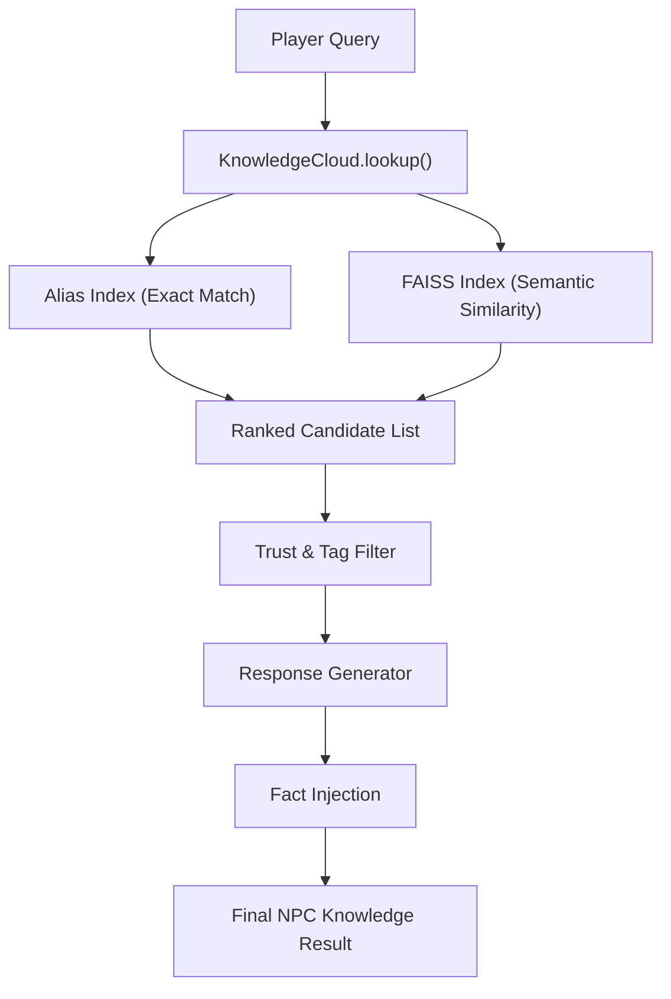

# Knowledge Cloud — Technical Documentation
AIVM Synthesus 2.0

The **Knowledge Cloud** is a shared, semantically queryable repository of world-level knowledge. It acts as a secondary cognitive layer for NPCs, allowing them to access facts, lore, and entities that are not part of their personal character genome but are critical for world awareness.

---

## 1. Architecture Overview

The Knowledge Cloud is built using a "Semantic Hybrid" approach:
1.  **Direct Alias Matching**: Fast-path lookup for exact or partial entity names (e.g., "Tell me about the Duke").
2.  **Semantic Vector Search**: Uses `SwarmEmbedder` (TF-IDF + SVD) to convert prose descriptions and facts into 128-dimensional vectors, indexed by **FAISS** for <2ms retrieval.
3.  **Contextual Filtering**: Results are filtered by **Player Trust** (gating secrets) and **Entity Tags**.



---

## 2. Core Components

### `KnowledgeEntry` (Data Model)
Stored as JSON objects in `data/knowledge_cloud/`.
- `entity_id`: Unique slug (e.g., `missing_caravans`).
- `entity`: Display name.
- `description`: Primary prose used for NPC responses.
- `facts`: A list of specific truth-claims about the entity.
- `trust_threshold`: Minimum trust (0-100) required to access this entry.
- `emotion_variants`: Emotion-specific prose overrides (e.g., the NPC sounds "afraid" when talking about Wraiths).

### `KnowledgeCloud` (The Engine)
Located in `core/knowledge_cloud.py`.
- **Initialization**: Automatically loads all `.json` files in the data directory and builds the FAISS index.
- **Search**: `search(query, top_k)` returns raw `KnowledgeResult` objects.
- **Lookup**: `lookup(query, emotion, trust)` provides a high-level interface compatible with the existing `KnowledgeGraph`.

---

## 3. Integration Points

### Cognitive Engine Fallback Cascade
The Knowledge Cloud is integrated at two critical points in `cognitive/cognitive_engine.py`:
1.  **Primary Fallback**: If a character's local `knowledge.json` doesn't have a match, it queries the Knowledge Cloud immediately.
2.  **Secondary Fallback**: If pattern matching and the personality bank both fail, it performs a "second chance" lookup in the cloud before hitting the generic "I don't know" response.

### Universal Substrate
Mapped as a virtual domain in `core/universal_substrate.py`. This allows the **Smart FS** to synchronize world lore across different sharded instances of the platform using the same pattern as character genomes.

---

## 4. REST API Endpoints

The cloud is exposed via `api/knowledge_cloud_router.py` at `/api/v1/knowledge`:

| Endpoint | Description |
|---|---|
| `GET /search?q={query}` | Perform a semantic search and return ranked results. |
| `GET /entries` | List all registered world entities. |
| `POST /entries` | Add a new piece of lore to the world. |
| `POST /rebuild-index` | Manually trigger a FAISS re-index (useful after bulk updates). |
| `GET /stats` | Get hits/misses, index size, and build latency. |

---

## 5. Usage Example

### Adding Lore via CLI (Example)
```bash
curl -X POST "http://localhost:8000/api/v1/knowledge/entries" \
     -H "Content-Type: application/json" \
     -d '{
       "entity": "The Forbidden Library",
       "entity_type": "location",
       "description": "An ancient archive hidden beneath the sands.",
       "facts": ["Contains the lost spells of the Solar Age"],
       "trust_threshold": 75
     }'
```

### NPC Query Sequence
1. Player: "What do you know about the missing caravans?"
2. NPC Generic Logic: Check `Garen/knowledge.json` -> **MISS**
3. NPC Knowledge Cloud Logic: Query Cloud -> **HIT** (`missing_caravans`)
4. NPC Response: "Three caravans have vanished on the Northern Road... drivers reported shadows moving impossibly fast."
