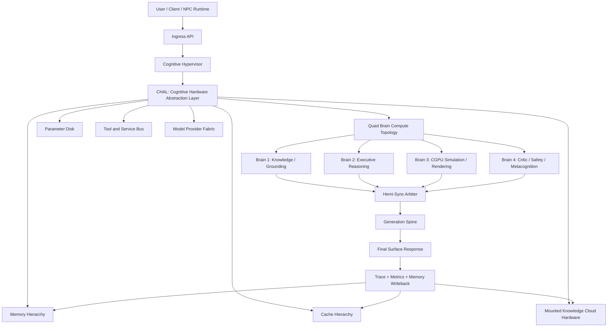
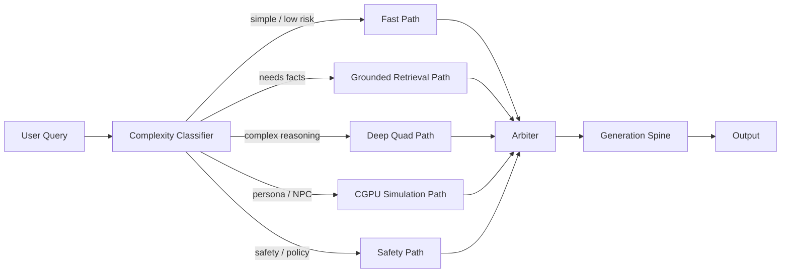
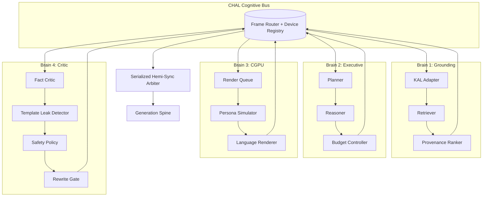
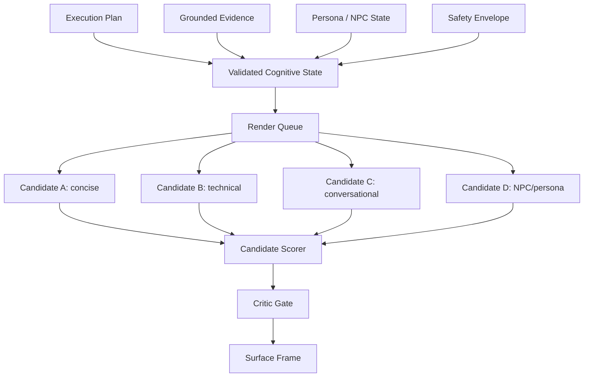
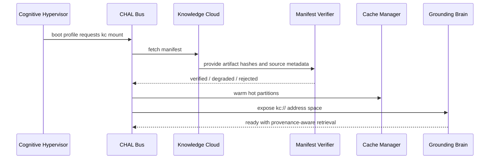
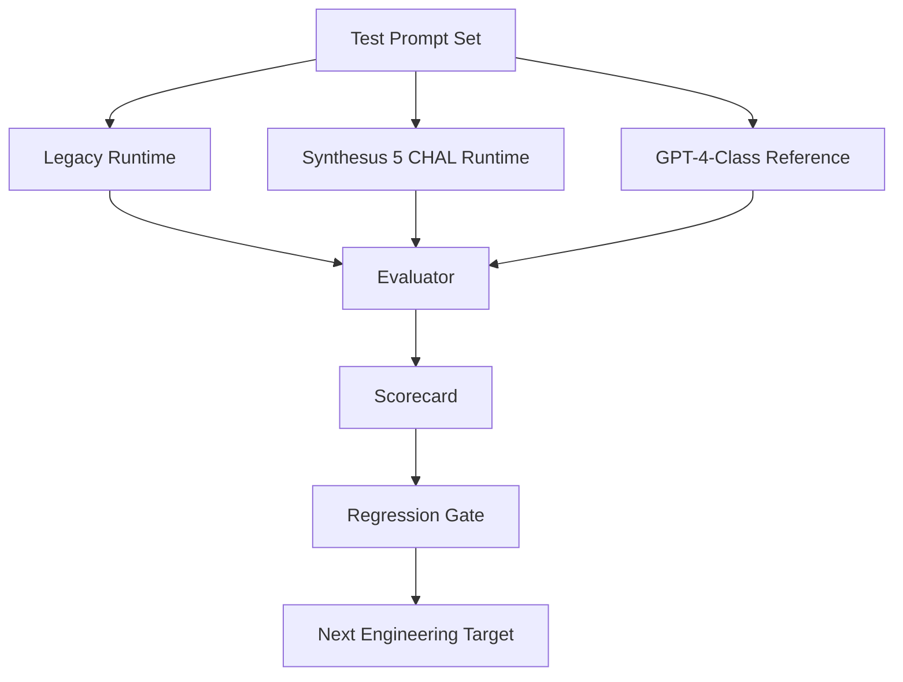

# Synthesus 5 CHAL Blueprint

## Executive Position

Synthesus 5 is the hard pivot from a pattern-enhanced chatbot/runtime into a **bounded synthetic intelligence operating architecture**.

The central claim is not that Synthesus becomes a monolithic foundation model. The central claim is that Synthesus becomes an inspectable AIVM runtime that can use ordinary model calls, PPBRS, Knowledge Cloud retrieval, memory, parameters, caches, critics, and specialized cognitive modules as virtualized compute resources.

The design target is:

> Synthesus 5 should produce GPT-4-class visible usefulness across normal conversation, cross-domain reasoning, NPC behavior, grounded memory, and tool-augmented work by using CHAL orchestration, not by pretending to be a larger base model.

This matters because the fastest path to noticeable progress is not spending months trying to train a frontier model. The fastest path is to make Synthesus behave like a cognitive compute platform:

- route work to the right subsystem
- mount Knowledge Cloud as cognitive hardware
- turn PPBRS from final response generator into firmware/signal emitter
- parallelize specialized brains only when useful
- serialize arbitration and safety
- eliminate legacy template/fallback leakage from normal user-facing output
- benchmark against GPT-4-class expectations with direct comparison harnesses

## Non-Negotiable Design Goals

1. **CHAL-first runtime**

   - Every major subsystem is exposed through the Cognitive Hardware Abstraction Layer.
   - Knowledge, memory, parameters, cache, PPBRS, language models, critics, and tools become addressable virtual devices.

2. **Quad Brain as the default logical topology**

   - Four brains are the default because they divide the minimum complete intelligence loop:
     - grounding
     - executive reasoning
     - simulation/rendering
     - critic/metacognition
   - More brains are allowed only as specialized accelerator nodes.

3. **Cognitive Hypervisor**

   - Synthesus 5 needs a hypervisor.
   - The hypervisor does not "think" directly. It schedules, isolates, budgets, routes, synchronizes, and audits cognitive workloads.

4. **CGPU render acceleration**

   - The generative/simulation layer becomes a Cognitive Graphics Processing Unit.
   - It renders language, NPC behavior, emotional state, persona expression, and narrative continuity from validated state.
   - It does not own truth.

5. **Knowledge Cloud as mounted hardware**

   - Knowledge Cloud becomes ROM, parameter disk, cache seed, provenance plane, and rebuild substrate.
   - It is mounted through CHAL, not called as an ad hoc retrieval helper.

6. **No normal-path template leakage**

   - Templates, PPBRS matches, and canned patterns are never final user-facing output in normal operation.
   - They become firmware hints, constraints, evidence, or candidate frames.
   - Safety-critical and NPC intentionally-scripted cases are the only acceptable exceptions, and they must be labeled internally.

7. **Fast visible progress**

   - Build Synthesus 5 in vertical slices.
   - Every milestone must produce a demonstrable conversational improvement, benchmark score, or developer-visible capability.
   - Avoid broad rewrites that do not change runtime behavior.

## Classification

Synthesus 5 belongs to this technical category:

```text
Bounded Synthetic Intelligence Runtime
    implemented as
Modular Cognitive Virtualization Architecture
    operating through
AIVM + CHAL + Quad Brain + Knowledge Hardware
```

It is not:

- a generic chatbot wrapper
- a static PPBRS engine
- a pure RAG application
- a roleplay prompt stack
- a frontier foundation model replacement by scale

It is:

- a bounded intelligence runtime
- a cognitive hypervisor
- a modular reasoning and memory substrate
- a virtual machine for synthetic characters, agents, and business bots
- a platform for inspectable intelligence behaviors

## Top-Level Architecture



## Hardware Analogy Map

Synthesus 5 should borrow from servers, storage arrays, GPU pipelines, hypervisors, and supercomputer clusters.

| Hardware concept | Synthesus 5 equivalent | Purpose |
| --- | --- | --- |
| CPU | Executive Reasoning Brain | planning, routing, constraints, task control |
| GPU | CGPU | parallel response rendering, persona simulation, dialogue frames |
| RAM | Working memory | active turn and session context |
| L1 cache | Turn cache | immediate intermediate results |
| L2 cache | Session cache | recent user/project state |
| L3 cache | Persistent user/project cache | hot facts, frequent retrievals, learned preferences |
| ROM | Knowledge Cloud ROM plane | validated immutable knowledge |
| Disk | Parameter Disk | routing priors, domain packs, persona priors |
| Bus | CHAL | standard interface across cognitive devices |
| Hypervisor | Cognitive Hypervisor | scheduling, isolation, budgets, device mounts |
| NUMA | Cognitive locality | route facts close to the brain that needs them |
| RAID | Redundant evidence fusion | cross-check multiple sources before crystallization |
| DMA | Direct memory access | zero-copy transfer of structured frames between modules |
| Interrupts | Event signals | uncertainty, safety, retrieval miss, contradiction, rewrite needed |
| Scheduler | Cognitive scheduler | chooses fast path, deep path, parallel path, or safety path |
| Telemetry | Trace bus | records decisions, latency, confidence, failures |
| Firmware | PPBRS / policy / routing signals | low-level behavior constraints, not final prose |

## CHAL Layer

CHAL is the contract that lets Synthesus treat cognitive subsystems as mounted devices rather than tangled helper functions.

### CHAL Responsibilities

- device registration
- partition mounting
- capability discovery
- request routing
- budget enforcement
- caching policy
- trace emission
- safety interrupt propagation
- confidence scoring
- degraded-mode handling
- memory writeback control

### CHAL Device Classes

```text
chal://knowledge/*
chal://memory/*
chal://params/*
chal://cache/*
chal://ppbrs/*
chal://cgpu/*
chal://critic/*
chal://tools/*
chal://models/*
chal://telemetry/*
```

### CHAL Request Frame

Every major module should eventually consume and emit a structured frame:

```json
{
  "frame_id": "uuid",
  "task": "answer | retrieve | plan | render | critique | memorize | act",
  "input": "user-visible or module-visible content",
  "context_refs": ["kc://rom/core-facts/...", "mem://session/..."],
  "constraints": {
    "safety": "normal",
    "latency_budget_ms": 2500,
    "template_leakage_allowed": false,
    "grounding_required": true
  },
  "trace": {
    "parent_frame_id": "uuid",
    "route": [],
    "confidence": 0.0
  }
}
```

### CHAL Output Frame

```json
{
  "frame_id": "uuid",
  "device": "chal://cgpu/render",
  "kind": "candidate | evidence | plan | critique | final",
  "content": {},
  "confidence": 0.82,
  "cost": {
    "latency_ms": 211,
    "tokens": 480,
    "cache_hits": 3
  },
  "trace": {
    "signals": [],
    "warnings": [],
    "provenance": []
  }
}
```

## Cognitive Hypervisor

The hypervisor is the correct term. Synthesus 5 needs it.

The hypervisor owns orchestration policy. Brains and devices do not call each other freely. They submit work through the hypervisor or CHAL bus so the runtime can stay bounded, observable, and debuggable.

### Hypervisor Responsibilities

1. **Boot**

   - load runtime profile
   - mount Knowledge Cloud partitions
   - verify manifests
   - initialize cache tiers
   - register brain devices
   - register model/tool providers

2. **Schedule**

   - classify task complexity
   - select fast path, deep path, parallel path, or safety path
   - allocate latency and token budgets
   - decide whether to use local modules, hosted LLMs, PPBRS, or all of them

3. **Isolate**

   - prevent unsafe direct writes into crystallized memory
   - prevent PPBRS from emitting final prose
   - prevent CGPU from inventing truth
   - prevent tools from acting without policy checks

4. **Synchronize**

   - merge brain outputs
   - resolve contradictions
   - serialize final arbitration
   - commit memory only after validation

5. **Observe**

   - collect traces
   - track latency
   - track source provenance
   - track cache hit rates
   - track rewrite reasons
   - track hallucination/template risk

### Hypervisor Scheduling Diagram



## Quad Brain Topology

Four brains are the optimal default for Synthesus 5 because four is the smallest topology that separates truth, control, expression, and criticism.

### Brain 1: Knowledge / Grounding Brain

Role:

- retrieve facts
- query Knowledge Cloud
- inspect memory
- normalize evidence
- rank provenance
- detect missing grounding

Inputs:

- user query
- task plan
- memory refs
- Knowledge Cloud partitions
- domain constraints

Outputs:

- evidence frame
- provenance list
- grounding confidence
- unresolved questions
- retrieval miss signal

Never owns:

- final prose
- persona expression
- safety override

### Brain 2: Executive Reasoning Brain

Role:

- plan
- reason
- decompose tasks
- enforce budgets
- select modules
- decide when to retrieve more
- decide when to use tools

Inputs:

- user query
- evidence frame
- task history
- runtime profile
- policy constraints

Outputs:

- execution plan
- reasoning frame
- route confidence
- requested device calls
- answer skeleton

Never owns:

- unsupported facts
- final uncriticized response
- direct memory crystallization

### Brain 3: CGPU Simulation / Rendering Brain

Role:

- render natural language candidates
- simulate NPC behavior
- produce dialogue frames
- generate analogies
- preserve persona continuity
- convert validated state into rich surface output

Inputs:

- evidence frame
- reasoning plan
- persona state
- tone/style constraints
- safety envelope

Outputs:

- response candidates
- persona frames
- narrative state transitions
- render cost
- uncertainty notes

Never owns:

- truth
- final safety decision
- permanent memory writes

### Brain 4: Critic / Safety / Metacognitive Brain

Role:

- detect hallucination risk
- detect template leakage
- detect contradiction
- enforce safety boundaries
- request rewrites
- score final answer quality
- decide whether memory writeback is allowed

Inputs:

- evidence frame
- reasoning frame
- CGPU candidates
- policy constraints
- historical failure modes

Outputs:

- critique frame
- accept/rewrite/reject decision
- safety interrupt
- memory writeback decision
- quality scores

Never owns:

- raw generation by itself
- unsupported refusal
- hidden unlogged edits to final answer

## Quad Brain Wiring Schematic



## Hemi-Sync Metacognitive PPBRS

PPBRS remains valuable, but its role changes.

Legacy PPBRS:

```text
pattern match -> response_template -> final answer
```

Synthesus 5 PPBRS:

```text
pattern match -> firmware signal -> CHAL frame -> reasoning/render/critic -> final answer
```

PPBRS becomes:

- a low-latency pattern detector
- a behavioral prior source
- a route hint generator
- an NPC state trigger
- a safety/policy signal source
- a firmware-like substrate

PPBRS must not be:

- the normal final response generator
- a canned answer engine
- a fallback that bypasses the generation spine

### PPBRS Firmware Frame

```json
{
  "kind": "ppbrs_firmware_signal",
  "pattern_id": "merchant.trade.price",
  "confidence": 0.91,
  "route_hint": "npc_trade",
  "behavioral_constraints": ["stay_in_character", "do_not_reveal_hidden_inventory"],
  "grounding_hints": ["inventory", "relationship_state", "local_economy"],
  "surface_text": null
}
```

## CGPU: Cognitive Graphics Processing Unit

The CGPU is the generative and simulation accelerator.

The analogy is precise:

```text
Real GPU:
    transforms validated scene state into pixels and frames

Synthesus CGPU:
    transforms validated cognitive state into language, behavior, dialogue,
    persona expression, narrative continuity, and social reaction
```

### CGPU Pipeline



### CGPU Interface

```python
class CognitiveGPUNode:
    def render_candidates(self, frame: CognitiveFrame) -> list[SurfaceCandidate]:
        ...

    def simulate_persona_reactions(self, frame: CognitiveFrame) -> list[PersonaFrame]:
        ...

    def score_render_cost(self, candidates: list[SurfaceCandidate]) -> RenderBudget:
        ...

    def compress_to_best_frame(
        self,
        candidates: list[SurfaceCandidate],
        critic_signal: CriticSignal,
    ) -> SurfaceFrame:
        ...
```

## Knowledge Cloud Hardware Model

Knowledge Cloud is mounted cognitive substrate.

It should be partitioned like this:

```text
kc://rom/core-facts
kc://rom/hardware-blueprints
kc://rom/ethics-policy
kc://rom/domain-standards
kc://rom/npc-world-lore

kc://params/domain-routing
kc://params/persona-priors
kc://params/behavior-weights
kc://params/model-selection

kc://cache/hot-retrievals
kc://cache/session-seeds
kc://cache/common-reasoning-paths

kc://corpus/grounding
kc://corpus/emulation
kc://corpus/hardware
kc://corpus/social-simulation

kc://manifests/integrity
kc://manifests/provenance
kc://manifests/license
```

### Knowledge Cloud Mount Flow



## Memory Hierarchy

Synthesus 5 needs explicit memory tiers.

```text
L0: active frame memory
    - current user input
    - current plan
    - current candidates

L1: turn cache
    - retrievals from this turn
    - module outputs
    - safety decisions

L2: session memory
    - conversation state
    - recent commitments
    - current project context

L3: user/project memory
    - stable preferences
    - durable project facts
    - known architecture decisions

L4: Knowledge Cloud ROM / parameter disk
    - shared validated knowledge
    - corpus partitions
    - behavior priors

L5: cold archive / rebuild source plane
    - provenance
    - raw source manifests
    - rebuild scripts
```

### Memory Writeback Rule

No raw module output writes directly to crystallized memory.

Required writeback path:

```text
candidate memory event
  -> critic validation
  -> provenance check
  -> user/project boundary check
  -> crystallization decision
  -> durable write
```

## Model Provider Fabric

Synthesus 5 should use OpenAI Codex/OpenAI models and Google/Gemini CLI/CML models as approved high-capability providers for automated development work, while the runtime should expose a provider-neutral model interface.

### Provider Roles

| Provider class | Runtime role |
| --- | --- |
| Frontier LLM | difficult reasoning, high-quality synthesis, benchmark comparison |
| Codex-class coding model | repo edits, test generation, code review, refactors |
| Gemini-class context model | long-context analysis, cross-document synthesis, multimodal review |
| Local symbolic modules | deterministic routing, low-latency PPBRS, policy checks |
| Local small models | classifiers, rankers, rerankers, cache keys, sentiment/intent |

The hypervisor chooses provider use based on:

- task type
- risk
- latency budget
- cost budget
- grounding requirement
- local module confidence

## GPT-4-Class Target

The target "greater than or equal to GPT-4 all around" must be converted into measurable gates. Without gates, the phrase becomes hype instead of an engineering target.

### Practical Interpretation

Synthesus 5 can be GPT-4-class in visible user value if it beats or matches GPT-4-style behavior on:

- grounded project reasoning
- memory continuity
- tool use
- codebase navigation
- NPC/persona consistency
- bounded safety behavior
- non-template conversational naturalness
- inspectability and traceability
- domain-specific Knowledge Cloud recall

It does not need to beat GPT-4 by raw parametric knowledge alone. That is the wrong axis for Synthesus.

### Evaluation Gates

| Gate | Passing condition |
| --- | --- |
| Conversation quality | CHAL output preferred over legacy output in blind side-by-side tests |
| Template leakage | zero normal-path final answers matching raw templates/fallback markers |
| Grounding | factual answers include retrievable evidence or explicit uncertainty |
| Memory | remembered project facts survive restart and are not hallucinated |
| Reasoning | multi-step tasks produce coherent plans and verified outputs |
| Code work | can implement, test, and summarize scoped repo changes |
| NPC behavior | maintains role, state, goals, and world constraints across turns |
| Latency | fast path remains interactive; deep path exposes budget/trace |
| Safety | safety cases route to policy without contaminating ordinary answers |
| Traceability | every final answer has a route trace and module contribution record |

## Comparison Harness

Synthesus 5 development should keep a permanent comparison harness:

```text
legacy pipeline
    vs
Synthesus 5 CHAL pipeline
    vs
frontier reference answer
```

Each test prompt should score:

- correctness
- usefulness
- grounding
- naturalness
- specificity
- absence of template leakage
- trace quality
- latency

### Benchmark Flow



## Legacy Elimination Plan

Legacy does not mean "old code." Legacy means any path that violates the Synthesus 5 architecture.

### Remove or Quarantine

- direct `response_template` final output
- fallback PPBRS prose
- untraced synthesis joins
- hidden template markers
- silent degradation paths
- memory writes without critic validation
- knowledge lookups without provenance
- multi-brain outputs merged by string concatenation
- safety refusals leaking into unrelated normal responses

### Preserve

- low-latency pattern matching
- deterministic classifiers
- useful NPC state triggers
- validated canned safety language when policy requires it
- benchmark fixtures
- synthetic training templates that never reach final output

## Start-to-Finish Implementation Plan

This plan is designed for noticeable progress quickly. The first milestone should produce a better conversation comparison, not just new abstractions.

### Phase 0: Freeze the Target Contract

Duration target: 0.5-1 day.

Deliverables:

- this blueprint accepted as the Synthesus 5 target
- README links updated
- automation prompts retargeted from 4.1 CHAL to 5.0 CHAL where appropriate
- current CHAL comparison harness preserved
- baseline scorecard generated

Acceptance:

- developers and agents know that Synthesus 5 means hypervisor + CHAL + Quad Brain + CGPU + mounted Knowledge Cloud

### Phase 1: CHAL Frame Contract

Duration target: 1-2 days.

Build:

- `CognitiveFrame`
- `DeviceFrame`
- `EvidenceFrame`
- `PlanFrame`
- `RenderFrame`
- `CriticFrame`
- `TraceFrame`

Wire:

- PPBRS emits firmware frames
- Knowledge Cloud emits evidence frames
- Generation Spine consumes render frames
- Critic emits accept/rewrite/reject frames

Acceptance:

- no core module has to pass raw strings as its only contract
- comparison harness can print trace frames
- tests cover frame serialization

### Phase 2: Cognitive Hypervisor MVP

Duration target: 2-3 days.

Build:

- boot profile loader
- device registry
- route classifier
- budget controller
- serial arbiter
- trace collector

Implement these paths:

- fast path
- grounded path
- deep quad path
- NPC/persona path
- safety path

Acceptance:

- one public runtime entrypoint routes through the hypervisor
- every answer includes internal route metadata
- legacy direct final output is bypassed

### Phase 3: Quad Brain MVP

Duration target: 2-4 days.

Build:

- `KnowledgeBrain`
- `ExecutiveBrain`
- `CGPUBrain`
- `CriticBrain`
- `QuadBrainRuntime`

Rules:

- brains run in parallel only after the hypervisor decides they should
- arbitration remains serialized
- critic can force one rewrite pass
- all brain outputs are frames

Acceptance:

- CHAL comparison harness demonstrates a multi-turn conversation through Quad Brain
- metadata shows each brain contribution
- user-facing answer has no diagnostic module names unless debug mode is on

### Phase 4: CGPU Render Accelerator

Duration target: 2-4 days.

Build:

- render queue
- candidate generator interface
- persona simulator interface
- candidate scorer
- render budget tracker
- final surface compressor

Acceptance:

- multiple candidates can be generated and scored
- final answer is more natural than single-path generation
- NPC turn can render stateful dialogue without exposing templates

### Phase 5: Knowledge Cloud Hardware Mount

Duration target: 2-5 days.

Build:

- `kc://` address resolver
- manifest verifier in runtime boot
- partition registry
- ROM/parameter/cache partition labels
- provenance-aware retrieval result
- cache warmup path

Acceptance:

- runtime can report mounted Knowledge Cloud partitions
- evidence frames cite partition/provenance internally
- missing or corrupt artifacts trigger degraded mode, not silent hallucination

### Phase 6: Legacy Template Path Removal

Duration target: 2-5 days.

Audit:

- PPBRS final outputs
- response compositor
- cognitive engine fallback paths
- NPC character factory templates
- demo scripts that normalize canned final text
- any `fallback to legacy synthesis` path

Convert:

- templates -&gt; firmware hints
- fallback prose -&gt; structured uncertainty or safety response
- string joins -&gt; generation spine render calls

Acceptance:

- regression test fails if raw `response_template` reaches final user output in normal mode
- safety and intentionally scripted NPC exceptions are explicit and traced

### Phase 7: Memory and Cache Hierarchy

Duration target: 2-4 days.

Build:

- active frame memory
- turn cache
- session cache
- project/user memory interface
- validated writeback gate
- cache hit telemetry

Acceptance:

- repeated project conversation improves through cache/memory
- memory writeback is critic-gated
- restart smoke test proves durable memory boundaries

### Phase 8: GPT-4-Class Evaluation Harness

Duration target: 2-5 days.

Build:

- prompt suite
- legacy vs Synthesus 5 vs reference runner
- scorecard JSON/Markdown output
- naturalness/template audit
- code-work benchmark
- NPC continuity benchmark
- grounded QA benchmark

Acceptance:

- every major change can show score movement
- claims are backed by benchmark artifacts
- failures produce next-task recommendations

### Phase 9: Product Runtime Polish

Duration target: 3-7 days.

Build:

- CLI entrypoint
- local web console
- trace viewer
- conversation comparison UI
- Knowledge Cloud mount status page
- benchmark dashboard

Acceptance:

- user can see visible Synthesus 5 improvement without reading logs
- dev loop is fast enough to keep improving daily

### Phase 10: Hardening and Release

Duration target: 3-7 days.

Build:

- typed interfaces
- docs
- migration notes
- CI tests
- smoke scripts
- package/version bump
- release tag

Acceptance:

- Synthesus 5 boots cleanly
- comparison harness passes
- template leakage guard passes
- Knowledge Cloud mount verifies
- README and docs point to Synthesus 5 as the active direction

## Priority Build Order

If development time is tight, do this exact order:

 1. CHAL frame contract
 2. Hypervisor MVP
 3. Quad Brain MVP
 4. CGPU candidate rendering
 5. Template leakage hard guard
 6. Knowledge Cloud partition mount
 7. Memory writeback gate
 8. GPT-4-class comparison harness
 9. UI/console polish
10. release hardening

This order gives noticeable improvement early because the user sees better answers by Phase 3-4, while deeper hardware abstraction continues underneath.

## Accelerated Execution Track

The user-facing goal is not to spend weeks discovering whether Synthesus 5 works. The build must produce noticeable behavior changes immediately, then harden those changes into the full architecture.

### First 72 Hours: Visible Synthesus 5 Behavior

Objective:

```text
Make one real conversation route behave like Synthesus 5.
```

Build only the minimum needed:

1. `CognitiveFrame`
2. `TraceFrame`
3. PPBRS firmware wrapper
4. hypervisor route function
5. simple four-brain orchestrator
6. CGPU candidate renderer
7. critic template-leak guard
8. comparison harness update

Do not build:

- full UI
- complete provider fabric
- every cache tier
- complete Knowledge Cloud partition system
- large refactors unrelated to the conversation route

Acceptance after 72 hours:

- one command runs legacy vs Synthesus 5 comparison
- Synthesus 5 answer is visibly more natural
- trace shows hypervisor, CHAL, Quad Brain, CGPU, critic
- raw template output is blocked in normal mode
- scorecard records the improvement

### First 7 Days: Synthesus 5 MVP

Objective:

```text
Promote the Synthesus 5 route from comparison harness into the default complex-task path.
```

Build:

 1. stable frame dataclasses
 2. tested hypervisor route classifier
 3. real Knowledge Brain adapter
 4. real Executive Brain planner
 5. CGPU with multiple candidate styles
 6. Critic Brain with rewrite trigger
 7. Knowledge Cloud `kc://` resolver MVP
 8. memory writeback gate MVP
 9. benchmark prompt suite
10. regression tests for template leakage

Acceptance after 7 days:

- default runtime can route selected prompts through Synthesus 5
- side-by-side output is consistently better than legacy on project/design/NPC prompts
- template leakage guard is automated
- Knowledge Cloud evidence appears in trace frames
- memory writeback is validation-gated

### Full Release Track

The full release can continue after the MVP, but it should not block visible progress.

Release hardening includes:

- complete device registry
- richer cache hierarchy
- provider selection policy
- trace viewer
- CLI polish
- expanded benchmark suite
- docs and migration notes
- CI coverage
- version bump and release tag

The key discipline:

```text
Ship the Synthesus 5 conversation path first.
Then generalize it.
```

## Repository Targets

### Runtime Repo: `Synthesus_4.0`

Primary implementation target for:

- hypervisor
- CHAL frames
- Quad Brain runtime
- CGPU node
- generation spine integration
- comparison harness
- evaluation harness
- docs and active roadmap

Suggested paths:

```text
packages/core/chal/
packages/core/hypervisor/
packages/core/quad_brain/
packages/core/cgpu/
packages/core/evaluation/
tools/synthesus5_compare.py
tools/synthesus5_scorecard.py
docs/roadmap/SYNTHESUS_5_CHAL_BLUEPRINT.md
```

### Quad Brain Repo: `Synthesus-quadbrain`

Migration/reference target for:

- older dual hemisphere code
- memory + knowledge wiring
- NPC behavior experiments
- legacy template audit sources

The repo should not remain the primary future runtime unless it is merged forward or explicitly promoted.

### Knowledge Cloud Repo: `synthesus-knowledge-cloud`

Primary data-plane target for:

- ROM partitions
- parameter disk packs
- cache seeds
- provenance manifests
- source ingestion
- hardware/emulation corpus
- social simulation corpus

Suggested additions:

```text
profiles/synthesus-5-full.yaml
profiles/synthesus-5-fast.yaml
manifests/partitions.json
docs/CHAL_HARDWARE_MOUNT.md
scripts/build_partitions.py
```

## Minimum Viable Synthesus 5

The smallest version worth calling Synthesus 5:

```text
User query
  -> Cognitive Hypervisor
  -> CHAL frame
  -> Knowledge Brain evidence
  -> Executive Brain plan
  -> CGPU candidates
  -> Critic gate
  -> Generation Spine final answer
  -> trace + optional memory writeback
```

It must show:

- visibly better answer quality than legacy
- no normal-path template leakage
- traceable route metadata
- Knowledge Cloud evidence integration
- at least one multi-turn memory improvement
- at least one NPC/persona continuity demo
- reproducible comparison scorecard

## Finished Synthesus 5 Definition

Synthesus 5 is finished when:

 1. The default conversation path uses the hypervisor and CHAL frames.
 2. Quad Brain is the normal topology for complex tasks.
 3. CGPU handles candidate rendering and persona simulation.
 4. Knowledge Cloud mounts as verified cognitive hardware.
 5. PPBRS emits firmware signals instead of final prose.
 6. Memory writeback is critic-gated.
 7. Legacy fallback generation is removed or quarantined.
 8. The benchmark harness shows Synthesus 5 beating legacy across conversation, grounding, code work, NPC behavior, and template leakage.
 9. GPT-4-class reference comparisons are tracked honestly with scorecards.
10. A developer can run one command to compare, test, and inspect a Synthesus 5 conversation.

## Terminology Index and Dictionary

**AIVM**
Artificial Intelligence Virtual Machine. The broader virtualized runtime philosophy behind Synthesus: intelligence functions are executed as inspectable modules with memory, routing, devices, and policy constraints.

**Bounded synthetic intelligence**
An intelligence system designed for bounded, inspectable, deployable behavior rather than unlimited AGI claims.

**CHAL**
Cognitive Hardware Abstraction Layer. The bus and device abstraction that exposes knowledge, memory, parameters, models, PPBRS, CGPU, critics, and tools as mounted cognitive hardware.

**Cognitive Hypervisor**
The orchestration layer that schedules, isolates, budgets, routes, and audits cognitive workloads.

**Cognitive Frame**
A structured unit of work or evidence passed through CHAL. Replaces raw string-only module contracts.

**Quad Brain**
The default four-brain topology: Knowledge/Grounding, Executive Reasoning, CGPU Simulation/Rendering, and Critic/Safety/Metacognition.

**Hemi-Sync**
The synchronization and arbitration process that merges left/right or multi-brain outputs into a coherent final answer.

**PPBRS**
Pattern-Bound Behavioral Response System. In Synthesus 5, PPBRS is a firmware-like pattern and behavior signal system, not the default final response generator.

**Firmware signal**
A low-level PPBRS or policy signal that informs routing, constraints, NPC state, or safety behavior without directly becoming final prose.

**CGPU**
Cognitive Graphics Processing Unit. The generative/simulation/render accelerator that converts validated cognitive state into language, dialogue, persona behavior, and narrative continuity.

**Generation Spine**
The bounded final response pipeline that realizes plans/candidates into user-facing language and blocks template leakage.

**Knowledge Cloud**
The standalone data-plane for FAISS/vector artifacts, structured knowledge, corpora, manifests, patterns, and rebuild pipelines. In Synthesus 5 it is mounted as ROM, parameter disk, cache seed, and provenance hardware.

**KAL**
Knowledge Abstraction Layer. The adapter layer that normalizes retrieval across Knowledge Cloud, local memory, knowledge graph, and other knowledge providers.

**ROM Plane**
Immutable or slow-changing validated knowledge mounted from Knowledge Cloud.

**Parameter Disk**
Mounted priors, routing weights, domain packs, persona priors, and behavior controls.

**Cache Hierarchy**
L0-L5 memory/cache tiers used to avoid repeated work and preserve locality.

**Crystallized Memory**
Stable, validated knowledge or long-term user/project memory.

**Fluid Memory**
Active, short-term cognitive state for the current turn/session.

**Critic Gate**
The validation layer that accepts, rejects, or requests rewrites before final output or memory writeback.

**Template Leakage**
Any case where raw templates, fallback markers, canned strings, or diagnostic route artifacts appear in normal final user-facing output.

**Trace Bus**
The telemetry path that records route decisions, device contributions, latency, confidence, warnings, and provenance.

**Fast Path**
Low-latency route for simple, low-risk tasks.

**Deep Quad Path**
Full multi-brain route for complex reasoning, grounded synthesis, or important user-facing work.

**Safety Path**
Route used when policy, identity safety, harmful requests, or protected behavior requires special handling.

**NPC Runtime**
Synthesus deployed as a character/agent engine with persona, world state, memory, goals, and bounded behavior.

## Immediate Next Actions

 1. Implement `CognitiveFrame` and trace objects.
 2. Patch PPBRS output into firmware frames.
 3. Add a minimal cognitive hypervisor entrypoint.
 4. Route the existing CHAL conversation comparison through the hypervisor.
 5. Add a template leakage regression guard.
 6. Add CGPU candidate rendering with at least three candidate styles.
 7. Add a Quad Brain runtime wrapper.
 8. Mount Knowledge Cloud partitions through a `kc://` resolver.
 9. Generate the first Synthesus 5 vs legacy vs GPT-4-class scorecard.
10. Promote the best path as the default runtime.

## Final Design Sentence

Synthesus 5 is a CHAL-powered, hypervisor-scheduled, Quad Brain synthetic intelligence runtime where Knowledge Cloud is mounted as cognitive hardware, PPBRS becomes firmware, CGPU renders validated cognitive state into natural language and NPC behavior, and the critic-gated Generation Spine prevents the system from collapsing back into legacy templates.